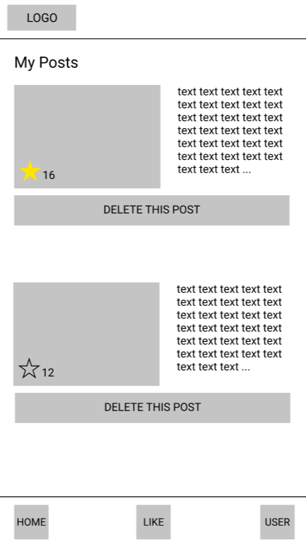

# SkillsSwapping

**SkillsSwapping is a app which wants to help people get closer and swap their skill**  
 

## Mock-up

|**1. Loading**|**2. Sign-in**|**3. Top**|**4. Category**|**5. Detail**|
|---|---|---|---|---|
||||||
|**6. User**|**7. New Post**|**8. Preview**|**9. My Posts**|**10. Likes**|
||||||

## Software architecture

## Featrue
* Login Page (MockUp 2)
  * Normal login  
  * Facebook login  
  * Google login  

* Home Page (MockUp 3)
  * Category List  
     * Art  
     * Cooking  
     * Programming  
     * Music  
     * Beauty  
     * Others  

* Like Page (MockUp 10)
  * Liked List  
    * Liked detail  

* User Page (MockUp 6)
  * Profile  
    * New Post 
    * My Post 
    * Liked Page 

## Backend
* Firebase

## Requirements
* minSdkVersion 19
* targetSdkVersion 29
